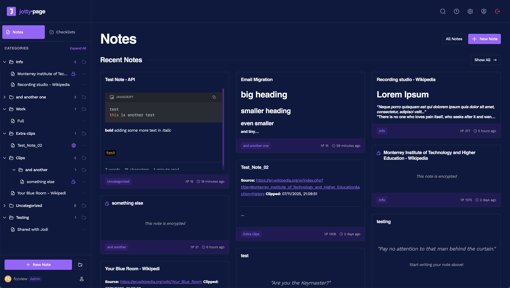
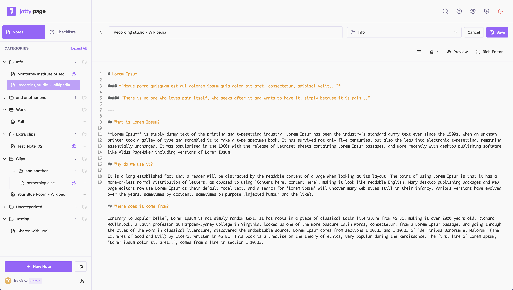

<p align="center">
   
  <br />
  <h1 align="center">jotty·page</h1><br/>
</p>

A self-hosted app for your checklists and notes.

[jotty·page](https://jotty.page) is a lightweight alternative for managing your personal checklists and notes. It's extremely easy to deploy, keeps all your data on your own server and allows you to encrypt/decrypt your notes for your personal peace of mind.

<p align="center"><i>ex rwMarkable</i></p>

---

<p align="center">
  <a href="https://discord.gg/invite/mMuk2WzVZu">
    
  </a>
  <a href="https://www.reddit.com/r/jotty">
    
  </a>
  <a href="https://t.me/jottypage">
    
  </a>
  <br />
  <br />
  <i>Join our communities</i>
  <br />
</p>

---

<br />

<div align="center">
  <p align="center">
    <em>Clean, intuitive interface for managing your checklists and tasks.</em>
  </p>
  

  <p align="center">
    <em>Rich text editor for notes.</em>
  </p>
  
</div>

## Quick nav

- [Features](#features)
- [Getting Started](#getting-started)
  - [Docker Compose (Recommended)](#docker-compose)
  - [Initial Setup](#initial-setup)
  - [Local Development (Without Docker)](#local-development-without-docker)
- [Data Storage](#data-storage)
- [Versioning Scheme](#versioning)
- [Encryption](#encryption)
- [API](#api)
- [Shortcuts](#shortcuts)
- [Single Sign-On (SSO) with OIDC](#single-sign-on-sso-with-oidc)
- [Multi-Factor Authentication (MFA)](#multi-factor-authentication)
- [Translations](#translations)
- [Custom Themes and Emojis](#custom-themes-and-emojis)

<p align="center">
  <br />
  <a href="https://www.buymeacoffee.com/fccview">
    
  </a>
</p>

<a id="features"></a>

## Features

- **Checklists:** Create task lists with drag & drop reordering, progress bars, and categories. Supports both simple checklists and advanced task projects with Kanban boards and time tracking.
- **Rich Text Notes:** A clean WYSIWYG editor for your notes, powered by TipTap with full Markdown support and syntax highlighting.
- **Sharing:** Share checklists or notes with other users on your instance, including public sharing with shareable links.
- **File-Based:** No database needed! Everything is stored in simple Markdown and JSON files in a single data directory.
- **User Management:** An admin panel to create and manage user accounts with session tracking.
- **Customisable:** 14 built-in themes plus custom theme support with custom emojis and icons.
- **Encryption:** Full on PGP encryption, read more about it in [howto/ENCRYPTION.md](howto/ENCRYPTION.md)
- **API Access:** Programmatic access to your checklists and notes via REST API with authentication.

<a id="getting-started"></a>

## Getting Started

My recommended way to run `jotty·page` is with Docker. You can also use:

- The [Proxmox community script](https://raw.githubusercontent.com/community-scripts/ProxmoxVE/main/ct/jotty.sh) for Proxmox VE
- The [Unraid template](howto/UNRAID.md) for Unraid Community Applications

<a id="docker-compose"></a>

### Docker Compose (Recommended)

1.  Create a `docker-compose.yml` file:

    **📖 For advanced settings and more information about how the docker compose file works and what these variables do, please read [howto/DOCKER.md](howto/DOCKER.md)**

    ```yaml
    services:
      jotty:
        image: ghcr.io/fccview/jotty:latest
        container_name: jotty
        user: "1000:1000"
        ports:
          - "1122:3000"
        volumes:
          - ./data:/app/data:rw
          - ./config:/app/config:rw
          - ./cache:/app/.next/cache:rw
        restart: unless-stopped
        environment:
          - NODE_ENV=production
    ```

2.  Create the data directory and set permissions:

    ```bash
    mkdir -p config data/users data/checklists data/notes data/sharing data/encryption cache
    sudo chown -R 1000:1000 data/
    sudo chown -R 1000:1000 config/
    sudo chown -R 1000:1000 cache/
    ```

    **Note:** The cache directory is optional. If you don't want cache persistence, you can comment out the cache volume line in your `docker-compose.yml`.

3.  Start the container:

    ```bash
    docker compose up -d
    ```

The application will be available at `http://localhost:1122`.

<a id="initial-setup"></a>

### Initial Setup

On your first visit, you'll be redirected to `/auth/setup` to create your admin account if SSO is disabled, otherwise you'll be prompted to sign in via your choosen SSO provider.

Once that's done, you're ready to go! First user will be admin by default.

<a id="local-development-without-docker"></a>

### Local Development (Without Docker)

If you want to run the app locally for development:

1.  **Clone & Install:**
    ```bash
    git clone <repository-url>
    cd checklist
    yarn install
    ```
2.  **Run Dev Server:**
    ```bash
    yarn dev
    ```
    The app will be running at `http://localhost:3000`.

<a id="data-storage"></a>

## Data Storage

`jotty·page` uses a simple file-based storage system inside the `data/` directory.

- `data/checklists/`: Stores all checklists as `.md` files.
- `data/notes/`: Stores all notes as `.md` files.
- `data/users/`: Contains `users.json` and `sessions.json`.
- `data/sharing/`: Contains `shared-items.json`.
- `data/encryption/`: Contains all public/private keys for all users.

**Make sure you back up the `data` directory!**

<a id="versioning"></a>

## Versioning Scheme

This project uses a `[STABLE].[FEATURE].[FIX]` versioning scheme, not strict [SemVer](https://semver.org/). As a product (not a package), this format makes more sense for my specific release cycle.

My format is `1.10.1`, which breaks down as:

- **`1.x.x` (Stable):** The `1` represents the current stable generation. I will only change this (e.g., to `2.0.0`) for a complete rewrite or a fundamental shift in the product or seriously breaking changes.

- **`x.10.x` (Feature):** This is the main release number. I increment this for new features, code refactors, or significant changes (e.g., `1.9.0` -> `1.10.0`). This is the equivalent of a SemVer `MINOR` bump.

- **`x.x.1` (Fix):** This is incremented _only_ for hotfixes, bug-fix-only and very minor feature releases (e.g., `1.10.0` -> `1.10.1`). This is the equivalent of a SemVer `PATCH` bump.

### A Note on "Breaking" Changes

A **Feature** release (like `1.10.0`) may include major backend or data structure changes. When this happens, **I will always provide an automatic migration script** that runs on first launch to update your data seamlessly.

Because the migration is automatic, I do not consider this a "breaking" change that requires a `2.0.0` version.

I will always detail these migrations in the release notes. I _highly recommend_ you **back up your data** before any feature update, just in case.

<a id="supported-markdown"></a>

## SUPPORTED MARKDOWN

`jotty·page` supports GitHub Flavored Markdown (GFM) and some custom syntax for complex functionality.

📖 **For the complete MARKDOWN documentation, see [howto/MARKDOWN.md](howto/MARKDOWN.md)**

<a id="encryption"></a>

## ENCRYPTION

`jotty·page` uses industry standard PGP encryption.

📖 **For the complete ENCRYPTION documentation, see [howto/ENCRYPTION.md](howto/ENCRYPTION.md)**

<a id="api"></a>

## API

`jotty·page` includes a REST API for programmatic access to your checklists and notes. This is perfect for:

- **Automation:** Create tasks from external systems
- **Integrations:** Connect with other tools and services
- **Scripts:** Automate repetitive tasks
- **Dashboards:** Build custom interfaces

📖 **For the complete API documentation, see [howto/API.md](howto/API.md)**

<a id="shortcuts"></a>

## SHORTCUTS

`jotty·page` supports a wide range of keyboard shortcuts to help you navigate and edit more efficiently without leaving the keyboard. They are divided into two main categories: global shortcuts that work anywhere in the app, and editor-specific shortcuts that work when you are writing a note.

📖 **For the complete SHORTCUTS documentation, see [howto/SHORTCUTS.md](howto/SHORTCUTS.md)**

<a id="single-sign-on-sso-with-oidc"></a>

## Single Sign-On (SSO) with OIDC

`jotty·page` supports any OIDC provider (Authentik, Auth0, Keycloak, Okta, Google, EntraID, etc.)

📖 **For the complete SSO documentation, see [howto/SSO.md](howto/SSO.md)**

<a id="multi-factor-authentication"></a>

## Multi-Factor Authentication (MFA)

`jotty·page` supports MFA, this needs to be enabled in settings -> profile

📖 **For the complete MFA documentation, see [howto/MFA.md](howto/MFA.md)**

<a id="translations"></a>

## Translations

`jotty·page` can be translated in multiple languages, all translations are community driven and can be found in the [app/\_translations](app/_translations) directory.

📖 **For the complete translations documentation, see [howto/TRANSLATIONS.md](howto/TRANSLATIONS.md)**

<a id="custom-themes-and-emojis"></a>

## Custom Manifest

You can completely customize your PWA by creating an override manifest file. This allows you to change the app name, description, icons, colors, and more. Custom themes and emojis can be managed through the admin UI.

📖 **For the complete customisation documentation, see [howto/CUSTOMISATIONS.md](howto/CUSTOMISATIONS.md)**
📖 **For better understanding on how the PWA works see [howto/PWA.md](howto/PWA.md)**

## Community shouts

I would like to thank the following members for raising issues and help test/debug them!

<table>
  <tbody>
    <tr>
      <td align="center" valign="top" width="20%">
        <a href="https://github.com/davehope"><br />davehope</a>
      </td>
      <td align="center" valign="top" width="20%">
        <a href="https://github.com/seigel"><br />seigel</a>
      </td>
      <td align="center" valign="top" width="20%">
        <a href="https://github.com/mariushosting"><br />mariushosting</a>
      </td>
      <td align="center" valign="top" width="20%">
        <a href="https://github.com/Isotop7"><br />Isotop7</a>
      </td>
      <td align="center" valign="top" width="20%">
        <a href="https://github.com/gavdgavd"><br />gavdgavd</a>
      </td>
    </tr>
    <tr>
      <td align="center" valign="top" width="20%">
        <a href="https://github.com/IGOLz"><br/>IGOLz</a>
      </td>
      <td align="center" valign="top" width="20%">
        <a href="https://github.com/floqui-nl"><br />floqui-nl</a>
      </td>
      <td align="center" valign="top" width="20%">
        <a href="https://github.com/fruiz1972"><br/>fruiz1972</a>
      </td>
      <td align="center" valign="top" width="20%">
        <a href="https://github.com/Sku1ly"><br />Sku1ly</a>
      </td>
      <td align="center" valign="top" width="20%">
        <a href="https://github.com/ItsNoted"><br />ItsNoted</a>
      </td>
    </tr>
    <tr>
      <td align="center" valign="top" width="20%">
        <a href="https://github.com/red-bw"><br/>red-bw</a>
      </td>
      <td align="center" valign="top" width="20%">
        <a href="https://github.com/kn0rr0x"><br />kn0rr0x</a>
      </td>
      <td align="center" valign="top" width="20%">
        <a href="https://github.com/mroovers"><br />mroovers</a>
      </td>
      <td align="center" valign="top" width="20%">
        <a href="https://github.com/Ryderjj89"><br />Ryderjj89</a>
      </td>
      <td align="center" valign="top" width="20%">
        <a href="https://github.com/spaghetti-coder"><br />spaghetti-coder</a>
      </td>
    </tr>
    <tr>
      <td align="center" valign="top" width="20%">
        <a href="https://github.com/hurleyy"><br />hurleyy</a>
      </td>
      <td align="center" valign="top" width="20%">
        <a href="https://github.com/schneider-de-com"><br />schneider-de-com</a>
      </td>
      <td align="center" valign="top" width="20%">
        <a href="https://github.com/zolakt"><br />zolakt</a>
      </td>
      <td align="center" valign="top" width="20%">
        <a href="https://github.com/Justus0405"><br />Justus0405</a>
      </td>
      <td align="center" valign="top" width="20%">
        <a href="https://github.com/mgrimace"><br />mgrimace</a>
      </td>
    </tr>
    <tr>
      <td align="center" valign="top" width="20%">
        <a href="https://github.com/bluegumcity"><br />bluegumcity</a>
      </td>
      <td align="center" valign="top" width="20%">
        <a href="https://github.com/4rft5"><br />4rft5</a>
      </td>
      <td align="center" valign="top" width="20%">
        <a href="https://github.com/godsking121"><br />godsking121</a>
      </td>
      <td align="center" valign="top" width="20%">
        <a href="https://github.com/pbuzdygan"><br />pbuzdygan</a>
      </td>
      <td align="center" valign="top" width="20%">
        <a href="https://github.com/rcallison"><br />rcallison</a>
      </td>
    </tr>
    <tr>
      <td align="center" valign="top" width="20%">
        <a href="https://github.com/BaccanoMob"><br />BaccanoMob</a>
      </td>
    </tr>
  </tbody>
</table>

## Star History

[](https://www.star-history.com/#fccview/jotty&type=date&legend=top-left)
